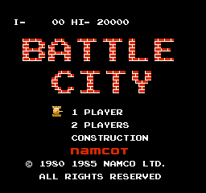
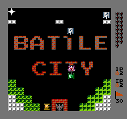

Yet another incomplete NES emulator written in OCaml.

It only supports batch mode, i.e. a commandline with a ROM and a number of frames to render (see 'run' rule)
It outputs a complete 6502 CPU trace in stdout + a bunch of other collaterals, img.ppm being the last frame.
There is also img.txt to show content of the two nametables, ram.bin for complete CPU RAM content and oam.bin for OAM.
There is no intent to make it playable; the idea here was to take a deep dive into NES uarch.

The only ROM this is tested with is Battle City:

CPU implementation passes a few tests, including obscure ones made by [Kevin Horton](https://github.com/christopherpow/nes-test-roms/blob/master/other/nestest.nes),
 but PPU is patchy and is tested on Battle City only. There is no sound support and no mappers either.

To build, run `make`. To run, obtain a ROM and either do `make run` or `./load_nes <number_of_frames_to_render> <path_to_your_rom>`
`make opt` will make you a native binary with ocamlopt; it works about six times faster.

There are no dependencies; default standard library is used.

Palette file is taken from FCEUX.

This project is licensed under the terms of the MIT license.
